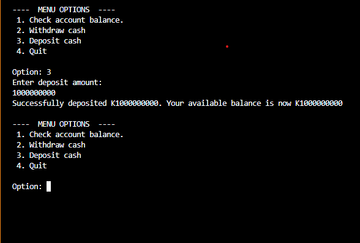

This is a simple "ATM application" replica.
It does really work as an actual ATM but only seeks to handle some ATM functionalities in C++ that can only be handled in your terminal and so whatever amount you wish to deposit, you can do so and no one can stop you even when you're as broke as me in real life. lol
Dreaming is free.

I am a billionaire in my own dreams:
 

